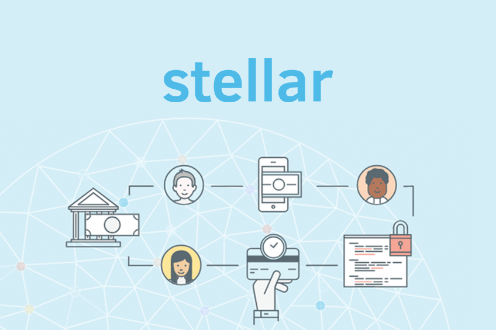
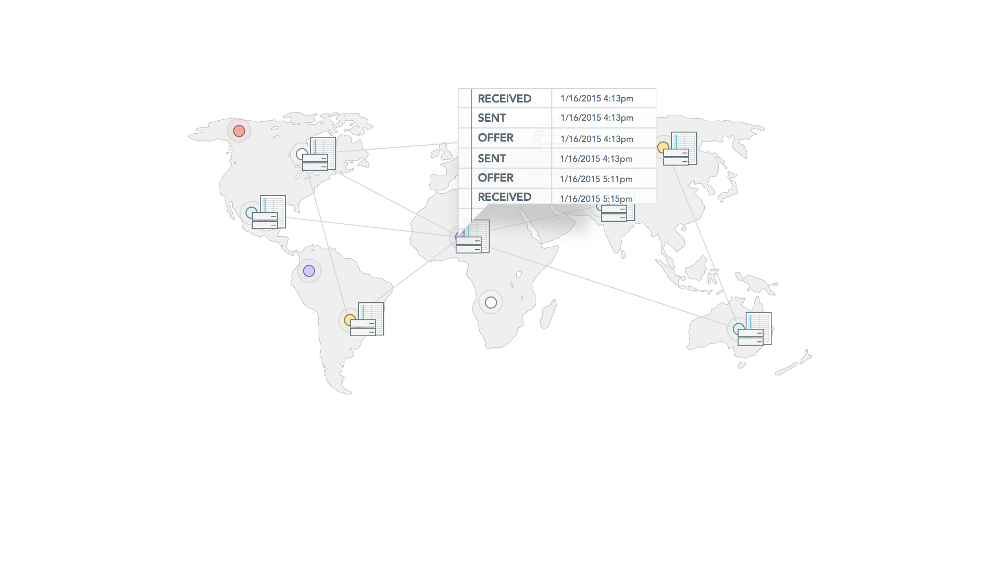
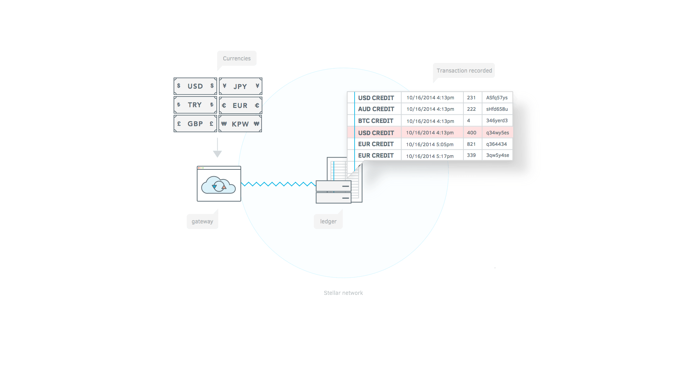
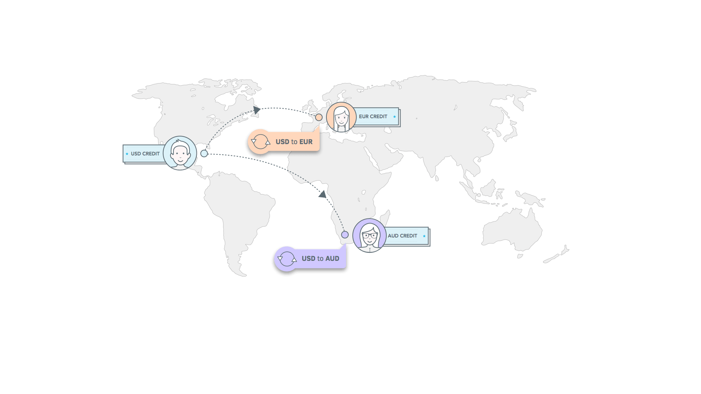
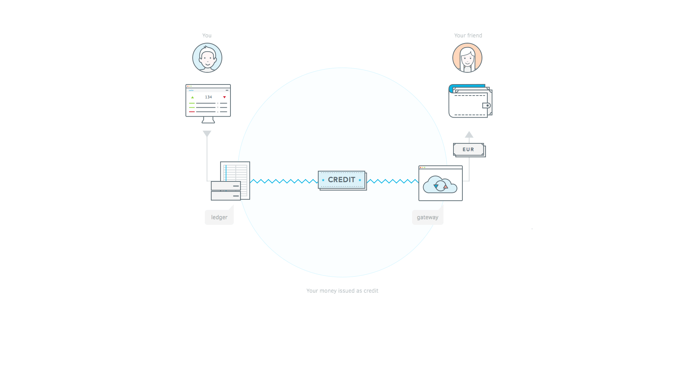
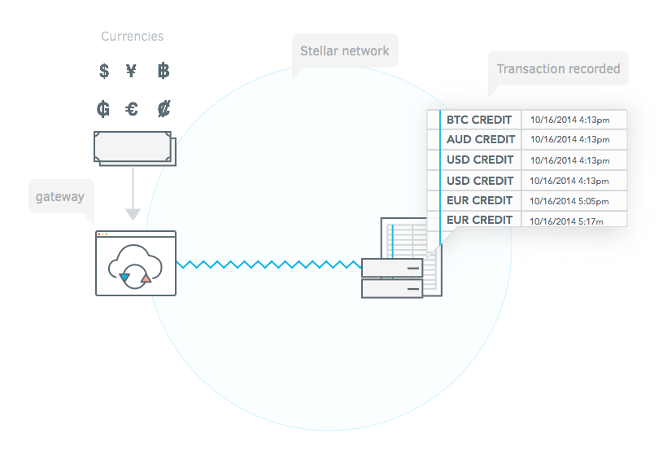

# Stellar Explained

- references:

  - <https://www.stellar.org/how-it-works/stellar-basics/#how-it-works>
  - <https://www.stellar.org/how-it-works/stellar-basics/explainers/>
  - <https://www.stellar.org/how-it-works/stellar-basics/#>
  - <https://www.stellar.org/how-it-works/use-cases/>

## Overview

- Stellar is a platform that connects **banks**, **payments systems**, and **people**.

- Integrate to move money **quickly**, **reliably**, and at almost **no cost**.

## How Stellar Network operates

- Q: How to send EUR to your friend using USD on the Stellar Network?

- A **decentralised network** of servers power the **distributed ledger**
- The ledger records every **transaction** in the system
- A copy of the global ledger exists on each Stellar server

- Every **2-5 seconds** servers communicate with each other to **verify transactions** and **sync the ledger** (**consensus process**)

- **Anchors** are provided as bridges between given currencies and Stellar network
- The ledger records your money as **Credit**, which is issued by anchors

- Anchors have to be trusted to hold your money and honor your withdrawals
- Issued credits can be sent and received on the network

- Thanks to **distributed exchange**, you can send EUR credits with your USD credit balance
- Your friend receive EUR credit which can withdraw using an anchor supporting EUR

## Anchor, trust and credit

- Entities that people trust to **hold their deposits** and **issue credits** into the Stellar network for those deposits.

- They act as a bridge between different currencies and the Stellar network.

- All money transactions in the Stellar network (except the native digital currency of lumens) occur in the form of credit issued by anchors.

### What does Anchors do

    1- They take your deposit and issue the corresponding credit to your account address on the Stellar ledger.

    2- You can make a withdrawal by bringing them credit they issued.

### Anchors vs PayPal

To use PayPal you deposit money in from your bank account. You recieve credit in your PayPal account. You can send your credit to anyone else trusting to PayPal, and then convert it to real money using PayPal by withdrawing it to the bank.

Anchors perform the same function in Stellar. The difference is, all the "Paypals" and other anchors are operating on the same network so they can all transact with each other now. People can now easily send and exchange all these different anchor credits with each other.
