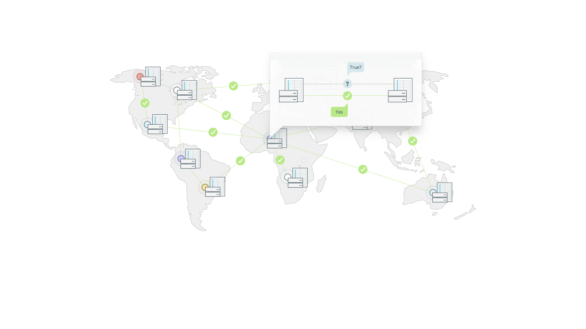

# Stellar Explained

- references:

  - <https://www.stellar.org/how-it-works/stellar-basics/#how-it-works>
  - <https://www.stellar.org/how-it-works/stellar-basics/explainers/>
  - <https://www.stellar.org/how-it-works/stellar-basics/#>
  - <https://www.stellar.org/how-it-works/use-cases/>

## Overview

- Stellar is a platform that connects **banks**, **payments systems**, and **people**.

- Integrate to move money **quickly**, **reliably**, and at almost **no cost**.

## How Stellar Network operates

- Q: How to send EUR to your friend using USD on the Stellar Network?

- A **decentralised network** of servers power the **distributed ledger**
- The ledger records every **transaction** in the system
- A copy of the global ledger exists on each Stellar server
- Every **2-5 seconds** servers communicate with each other to **verify transactions** and **sync the ledger** (**consensus process**)
- **Anchors** are provided as bridges between given currencies and Stellar network
- The ledger records your money as **Credit**, which is issued by anchors
- Anchors have to be trusted to hold your money and honor your withdrawals
- Issued credits can be sent and received on the network
- Thanks to **distributed exchange**, you can send EUR credits with your USD credit balance
- Your friend receive EUR credit which can withdraw using an anchor supporting EUR

